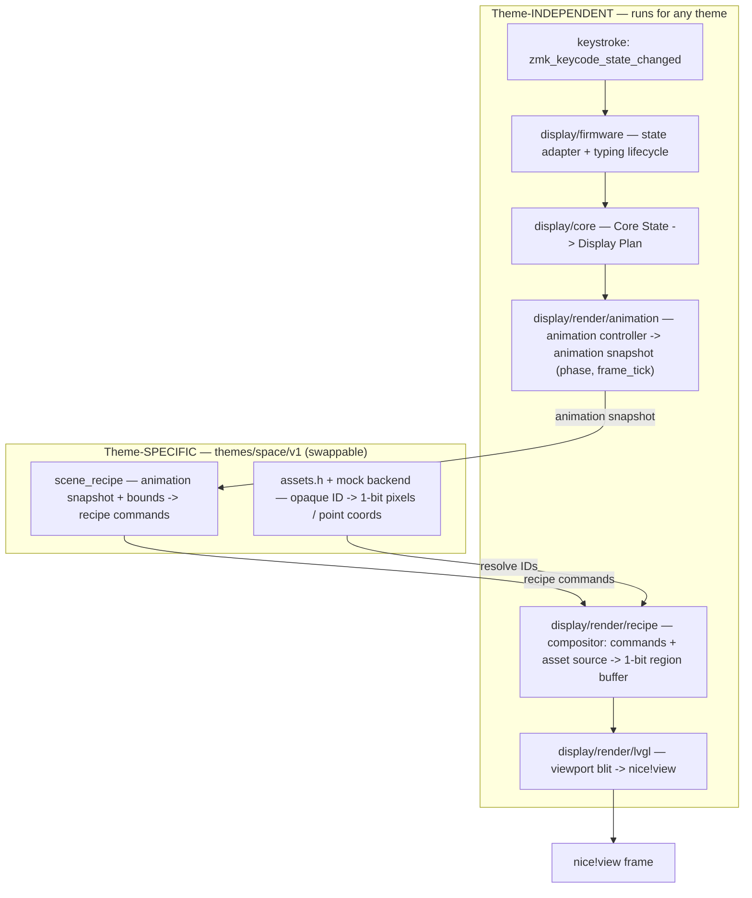

# Increment 8D Plan: Compositor + Mock Asset Backend + Recipe Rendering

## Context

8D makes pixels flow **from the recipe**. It adds the generic 1-bit compositor
and asset-source interface (`display/render/recipe/`), a temporary space/v1 mock
asset backend (`themes/space/v1/mock/`), and rewires firmware + sim to render the
recipe into a 1-bit region buffer. The `display/mock/` placeholder renderer is
retired: the "mock" concept moves from *mock renderer* to *mock assets*, exactly
as decided.

This pulls roadmap Inc 10 (compositor) forward using **mock** assets. Real
PNG→1-bit conversion + a generated C registry remain roadmap Inc 9, dropped in
later behind the same `asset_source` interface with no compositor/planner change.

Prereq: 8C (task #4–#6).

## End-state pipeline (keystroke → frame)

The flow wraps into **theme-independent** logic (runs for any theme) and
**theme-specific** logic (swappable per theme). The recipe command list is the
seam between them.

Everything in **Independent** is durable generic engine code. Everything in
**Themed** is what a new theme (or `space/v2`) replaces.

## New files

- `display/render/recipe/dual_display_asset_source.h` — generic backend
  interface: resolve opaque asset id → `{const uint8_t *pixels; const uint8_t
  *mask; const uint8_t *clearance; uint8_t w,h; uint8_t frame_count;}`; resolve
  opaque point-set id → `{const int16_t (*points)[2]; const uint16_t *point_asset;
  uint16_t count;}`. No LVGL/paths.
- `display/render/recipe/dual_display_compositor.{c,h}` — execute a recipe into a
  68×146 1-bit region buffer via an `asset_source`; blends `copy_with_mask`,
  `or_white`, `clear_black`; clip `draw_clipped_sprite`/negative origins to
  bounds. Deterministic, LVGL-free, host-testable.
- `themes/space/v1/mock/` (clearly temporary) — implements `asset_source` with
  hand-authored placeholder 1-bit sprites (filled box asteroid + mask +
  clearance, dot stars, short-line speed streaks, small galaxy shape, glow-blob
  twinkle) and the far/mid star coordinate tables from the v13 manifest.
- Host compositor determinism tests (extend `sim/engine/` + `test_recipe.py` or a
  new `test_compositor.py`).

## Rewiring

- `display/render/lvgl/dual_display_status_screen.c` — replace the placeholder
  render call with: build plan → animation snapshot → space/v1 recipe → compositor →
  1-bit region buffer → blit through `viewport` onto the canvas. The
  `screen_renderer.h` contract can stay, now implemented by the
  compositor-backed path instead of `display/mock/`.
- `sim/web/app.py` — render the same compositor output (real recipe renderer, not
  a flipbook of `output_frames/`).
- Remove `display/mock/lvgl/placeholder_renderer.c` and the `display/mock/`
  boundary; update `CMakeLists.txt`, `Kconfig` (`…_MOCK_RENDERER`), `verify.sh`,
  and docs.

## Validation

`make sim-test` + host compositor tests (deterministic pixel results for a fixed
recipe + mock assets: masking, clipping, blend modes, clear region), `make sim`
(visual: asteroid scene animates on both canvases from the recipe),
`make verify`. Firmware build remains GitHub Actions.

## Durable vs. temporary

Durable: compositor, asset-source interface, the rewired render path. Temporary:
`themes/space/v1/mock/` (placeholder pixels), replaced by the real converted
registry (Inc 9) behind the same interface.

## Intentionally incomplete

- Real converted 1-bit asset registry (roadmap Inc 9).
- Full sine motion choreography; charging overlay; layer flavors (Inc 12);
  peripheral environment + glitch/error asset sets.
