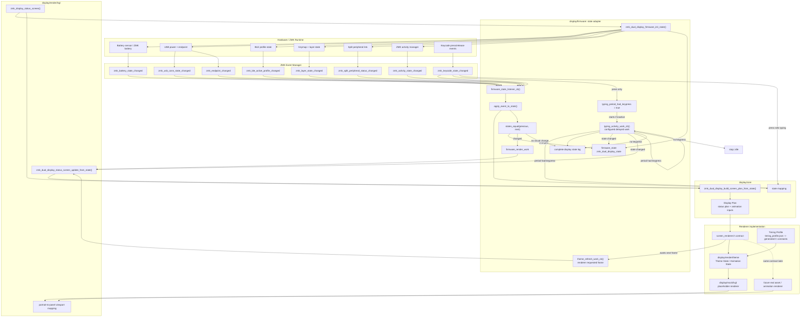

# Display Firmware Animation Flow

This document explains the firmware-side components that turn ZMK runtime
sources into the Eyelash Sofle dual nice!view display pipeline:

```text
ZMK runtime -> Core State -> Display Plan -> Theme State / Animation State -> renderer
```

The current renderer still uses temporary placeholder visuals under
`display/mock/`, but the state pipeline described here is durable firmware
architecture. The display engine keeps firmware state capture, LVGL lifecycle,
Display Plan construction, Theme State, and renderer implementation separate so
the mock renderer can be replaced without rewriting the state flow.

## Logical Components

### ZMK Runtime Sources

ZMK owns the hardware-facing runtime state:

- battery percentage and USB power state,
- activity state: active, idle, or sleep,
- active layer,
- selected output endpoint,
- BLE active profile connection status,
- split peripheral connection status,
- keycode press and release events.

The display engine does not poll these sources on a timer. It reads the current
values once during display creation, then reacts to ZMK events.

### Firmware State Adapter

`display/firmware/dual_display_state_adapter.c` owns the bridge from ZMK
runtime state to `display/core/`.

It keeps one `struct zmk_dual_display_state` in firmware memory and protects it
with a mutex. Event handlers copy the current state, apply the relevant event,
compare old and new state, and only queue a render when a visual field changed.

Central-only ZMK APIs, such as keymap and endpoint state, remain behind central
role guards so right-side peripheral firmware does not link central-only
objects.

### Core State And Display Plan

`display/core/dual_display_state.*` owns normalized display state:

- side and role,
- battery bucket including charging buckets,
- semantic activity state: idle, typing, or sleep,
- transport state,
- split-link state,
- layer mode.

This is the **Core State**. It is theme-independent and remains relevant across
any future animation theme.

`display/core/dual_display_plan.*` turns that state into a **Display Plan**:

- top status bar slots,
- lower animation-region scene,
- energy and charging modifiers,
- layer/activity values used by the renderer.

This layer is LVGL-free and asset-free. It describes what should be drawn, not
how it should be drawn.

`struct zmk_dual_display_animation_plan` is part of the Display Plan. It is the
theme-independent animation-section input, not theme-owned Animation State.

### LVGL Status Screen Boundary

`display/render/lvgl/dual_display_status_screen.c` owns the ZMK display entry
point:

```c
lv_obj_t *zmk_display_status_screen(void)
```

At display creation, it:

1. selects the firmware side from board config,
2. initializes firmware-backed display state,
3. creates the LVGL screen object,
4. builds a Display Plan,
5. renders the initial screen through the renderer contract.

Later event-driven refreshes enter through:

```c
int zmk_dual_display_status_screen_update_from_state(
    const struct zmk_dual_display_state *state)
```

### Renderer Contract

`display/render/lvgl/screen_renderer.h` defines the renderer contract consumed
by the LVGL status-screen boundary.

The current implementation lives in `display/mock/lvgl/placeholder_renderer.c`.
It draws placeholder status slots and animation scenes. A future real renderer
or asset playback engine should implement the same contract without changing
the firmware state adapter or core planner.

The renderer contract returns a small render result. Firmware uses that result
to schedule bounded redraws while renderer-local **Theme State / Animation
State** has active typing, decay, or idle-loop frames.

### Theme State And Timing Profile

`display/render/theme/` owns Theme State / Animation State. It observes Display
Plans and derives visual timeline values such as typing intensity, decay,
frame ticks, idle-loop animation, and visual display-sleep. This layer cannot
mutate Core State.

`display/render/theme/timing_profile.json` is the default Timing Profile. The
firmware CMake path and the host simulator both generate the same C-readable
timing constants from that JSON, so simulator-tuned defaults and firmware
defaults share one source.

Visual display-sleep is Theme State, not ZMK global sleep. After the Timing
Profile's idle timeout, the theme renders a frozen sleep frame and stops
requesting refreshes. If ZMK reports global sleep through Core State, that
Core State sleep still hard-overrides the theme immediately.

## Entry Points

### Initial State Entry

The initial state entry point is:

```c
void zmk_dual_display_firmware_init_state(
    enum zmk_dual_display_side side,
    struct zmk_dual_display_state *out_state)
```

It starts from the default side-specific display state, overlays current ZMK
runtime values, stores the result in the firmware adapter, and logs the initial
state transition.

This is the only place that performs a full current-state read without waiting
for events.

### Runtime Event Entry

The runtime entry point is the ZMK listener:

```c
ZMK_LISTENER(dual_display_firmware_state, firmware_state_listener_cb);
```

The listener subscribes to:

- `zmk_activity_state_changed`,
- `zmk_battery_state_changed`,
- `zmk_usb_conn_state_changed`,
- `zmk_endpoint_changed`,
- `zmk_keycode_state_changed`,
- `zmk_layer_state_changed`,
- `zmk_ble_active_profile_changed`,
- `zmk_split_peripheral_status_changed`.

Each event enters `firmware_state_listener_cb()`, which applies the event to a
copy of the current display state.

## Event Behavior

### Battery And Charging

Battery events map `state_of_charge` into a display battery bucket.

Charging is inferred from USB power state. USB connection events recalculate
the battery bucket because the same battery percentage may need to switch
between charging and not-charging variants.

### USB, BLE, And Endpoint

Endpoint events update the transport bucket on the central side.

USB selected transport maps to USB. BLE selected transport maps to connected
Bluetooth only when the active BLE profile is connected; otherwise it maps to a
disconnected transport state.

BLE active profile events also recalculate transport because the selected BLE
endpoint can remain the same while the active profile connection changes.

### Layers

Layer events are central-side only. The adapter reads
`zmk_keymap_highest_layer_active()` and maps known layer indexes into generic
display modes:

- type,
- symbol,
- mod,
- config.

The display core deliberately stores generic layer modes rather than keymap- or
art-specific names.

### Split Link

Split peripheral status events update the split-link bucket:

- connected,
- disconnected,
- unknown.

The peripheral side can initialize from its local split Bluetooth state where
that API is available. Other sides keep split link unknown until an event gives
the adapter a usable value.

### Activity

Runtime idle and sleep activity events update display activity directly.

Runtime active events do not directly advance animation-specific typing state.
Active is treated as a coarse ZMK runtime signal, while semantic display typing
state is owned by the lighter typing check lifecycle described below.

## Typing Lifecycle

Typing is intentionally split into a hot keypress path and a slower semantic
activity check path.

### Hot Keypress Path

On the central side, keycode events still reach the display adapter, but the
keypress handler does minimal work:

1. ignore release events,
2. set semantic display activity to `typing`,
3. set `typing_period_had_keypress = true`,
4. if no typing period is active, set `typing_period_active = true`,
5. schedule the first delayed work item using
   `CONFIG_ZMK_DUAL_DISPLAY_TYPING_CHECK_PERIOD_MS`.

The keypress path does not:

- calculate animation frames,
- calculate a typing streak from timestamps,
- log every key,
- store theme phase or decay state in core state.

### Typing Check Period

`typing_activity_work_cb()` runs from the ZMK display work queue after each
configured typing check period.

At the end of a period, it reads and clears the boolean that was set by
keypresses:

- If the period had a keypress:
  - keep semantic activity set to `typing`,
  - log the complete display state,
  - schedule the next typing check period.
- If the period had no keypress:
  - reset the active typing period fields,
  - set semantic activity to `idle`,
  - log the complete display state with `reason=typing-return-idle`,
  - redraw if the display state changed,
  - stop scheduling new typing check periods.

Theme-specific typing intensity, decay, and animation timing are intentionally
not part of core activity state.

## Render Lifecycle

The normal event render path is:

1. ZMK emits an event.
2. The firmware listener applies it to a copied display state.
3. The adapter compares previous and next state.
4. If no visual state changed, it logs a no-op and stops.
5. If visual state changed, it stores the new state and queues
   `firmware_render_work` on `zmk_display_work_q()`.
6. Render work calls
   `zmk_dual_display_status_screen_update_from_state()`.
7. The LVGL boundary rebuilds the Display Plan from Core State.
8. The renderer contract draws the plan and returns whether Theme State wants
   another frame.
9. If another frame is requested, the firmware adapter schedules
   `theme_refresh_work`; that work redraws from the latest stored firmware
   state without requiring a new ZMK event.

Typing period work is similar, but it is driven by a delayed configurable check
cycle instead of a direct ZMK state event.

## Complete Wiring Diagram



## Logging Expectations

Display-engine debug artifacts should expose `zmk_dual_display` logs over USB
CDC ACM.

Important runtime logs include:

- initial firmware-backed state,
- event application for battery, USB, endpoint, BLE, layer, activity, and split,
- state transition logs when a display field changes,
- no-op logs for handled events that do not change the visual state,
- once-per-period complete state logs from the typing lifecycle,
- theme scene entry and phase-change logs,
- theme refresh-loop start and stop logs,
- render queueing and refresh failures.

The typing lifecycle intentionally avoids per-key debug logs. The complete
state should be visible once per configured typing check period instead.
